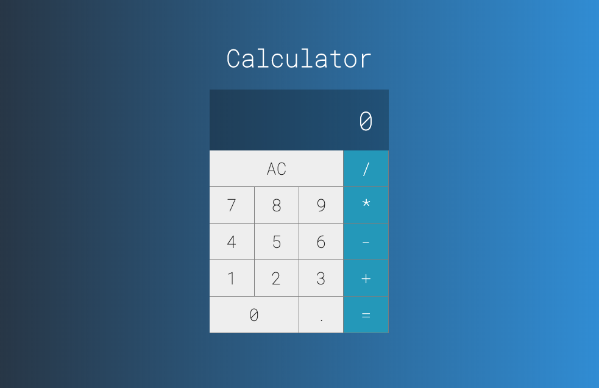

# Calculadora desenvolvida com React

- ### Projeto iniciado com [Create React App](https://github.com/facebook/create-react-app).

- ### Para execultar o projeto de o comando `npm start` dentro da pasta clone do repositorio.

- ### O app sera execultado no endereço http://localhost:3000 dentro do seu navegador.

### To start the project run the command `npm start`.

Runs the app in the development mode. 
Open [http://localhost:3000](http://localhost:3000) to view it in the browser.

This project was bootstrapped with [Create React App](https://github.com/facebook/create-react-app).
